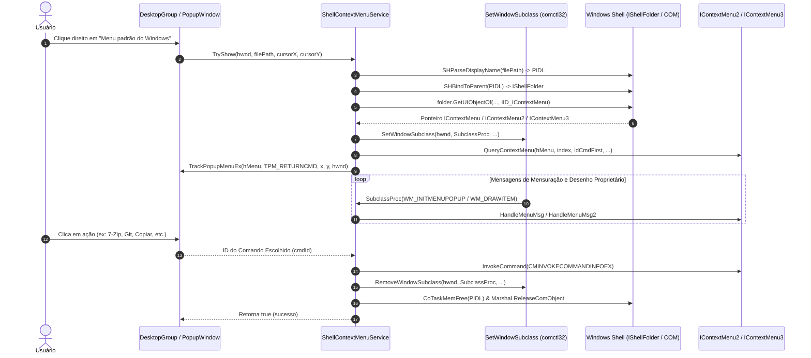
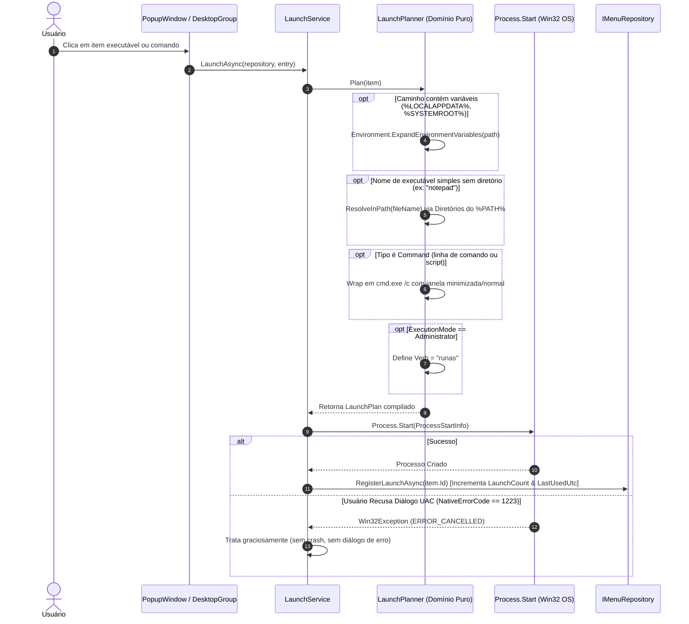
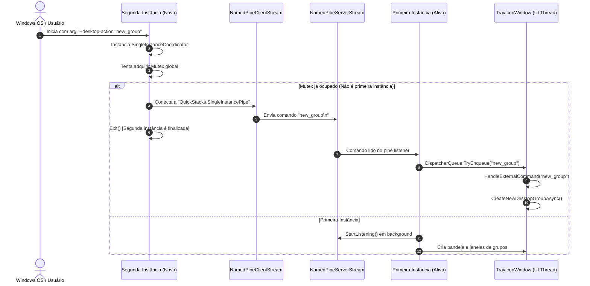
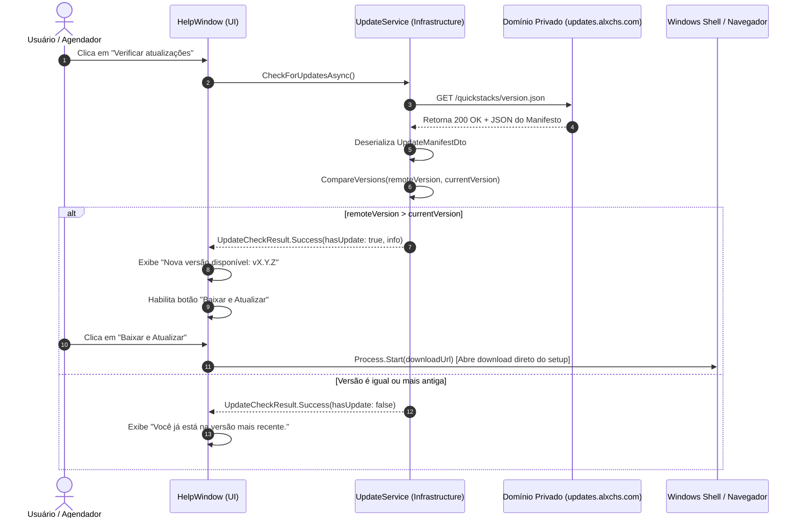

# QuickStacks — Diagramas de Classe e Arquitetura de Componentes

> **Versão:** 1.1.0  
> **Data:** Setembro de 2026  
> **Padrão:** Mermaid UML Diagrams  
> **Camadas:** Domain, Application, Infrastructure, UI, Localization

---

## 1. Diagrama de Classes Geral do Sistema

O diagrama abaixo ilustra as entidades, interfaces, serviços e ViewModels que compõem o ecossistema do QuickStacks, respeitando as fronteiras de Clean Architecture e SOLID.

```mermaid
classDiagram
    direction TB

    %% ==========================================
    %% DOMAIN LAYER (QuickStacks.Domain)
    %% ==========================================
    namespace QuickStacks_Domain {
        class MenuItem {
            +string Id
            +string? ParentId
            +string Name
            +MenuItemType Type
            +string? Path
            +string? Arguments
            +string? WorkingDirectory
            +string? Icon
            +int SortOrder
            +bool IsFavorite
            +int LaunchCount
            +DateTimeOffset? LastUsedUtc
            +DateTimeOffset CreatedAt
            +DateTimeOffset UpdatedAt
            +bool IsDesktopGroup
            +ExecutionMode ExecutionMode
            +bool IsFolder
            +CreateFolder(name, parentId, sortOrder)$ MenuItem
            +CreateShortcut(name, parentId, type, path, sortOrder)$ MenuItem
            +RegisterLaunch() void
        }

        class MenuItemType {
            <<enumeration>>
            Folder = 0
            Link = 1
            Command = 2
        }

        class ExecutionMode {
            <<enumeration>>
            Normal = 0
            Minimized = 1
            Maximized = 2
            Administrator = 3
        }

        class DesktopGroupDisplayMode {
            <<enumeration>>
            Panel = 0
            AppFolder = 1
        }

        class DesktopGroupPlacement {
            +string GroupId
            +int X
            +int Y
            +int Width
            +int Height
            +DesktopGroupDisplayMode DisplayMode
            +CreateDefault(groupId, x, y)$ DesktopGroupPlacement
        }

        class MonitorRect {
            +int Left
            +int Top
            +int Width
            +int Height
            +int Right
            +int Bottom
            +Contains(x, y) bool
        }

        class MonitorPlacement {
            +IndexOfOwner(rect, monitors)$ int
            +AdjacentIndex(currentIndex, monitors, direction)$ int?
            +ClampToWorkArea(rect, monitor)$ MonitorRect
        }

        class LaunchPlan {
            +string FileName
            +string Arguments
            +string? WorkingDirectory
            +ProcessWindowStyle WindowStyle
            +string? Verb
            +bool UseShellExecute
        }

        class LaunchPlanner {
            +Plan(item)$ LaunchPlan
            +ResolveInPath(fileName)$ string?
        }

        class UpdateInfo {
            +string Version
            +string DownloadUrl
            +string? Changelog
            +string? Sha256
            +bool IsMandatory
            +DateTime? ReleaseDateUtc
        }

        class UpdateCheckResult {
            +bool HasUpdate
            +string CurrentVersion
            +UpdateInfo? UpdateInfo
            +string? ErrorMessage
            +Success(hasUpdate, currentVer, info)$ UpdateCheckResult
            +Failure(currentVer, error)$ UpdateCheckResult
        }

        class IMenuRepository {
            <<interface>>
            +GetAllAsync() Task~IReadOnlyList~MenuItem~~
            +GetByIdAsync(id) Task~MenuItem?~
            +GetChildrenAsync(parentId) Task~IReadOnlyList~MenuItem~~
            +AddAsync(item) Task
            +UpdateAsync(item) Task
            +DeleteAsync(id) Task
            +MoveAsync(id, newParentId, newSortOrder) Task
            +ReorderChildrenAsync(parentId, orderedIds) Task
            +GetDesktopGroupsAsync() Task~IReadOnlyList~MenuItem~~
            +SetIsDesktopGroupAsync(id, isGroup) Task
            +GetDesktopGroupPlacementAsync(groupId) Task~DesktopGroupPlacement?~
            +SetDesktopGroupPlacementAsync(placement) Task
            +GetFolderBackgroundColorAsync(folderId) Task~string?~
            +SetFolderBackgroundColorAsync(folderId, hex) Task
            +RecordUsageAsync(id) Task
        }

        class IIconCacheService {
            <<interface>>
            +GetOrExtractIconAsync(path, isFolder, preferredSize) Task~string?~
            +ClearCache() void
        }

        class IShellContextMenuService {
            <<interface>>
            +TryShow(hwnd, path, screenX, screenY, extendedVerbs) bool
        }

        class IUpdateService {
            <<interface>>
            +string DefaultFeedUrl
            +CheckForUpdatesAsync(feedUrl, ct) Task~UpdateCheckResult~
            +CompareVersions(remote, local) int
        }

        class IConfigExportService {
            <<interface>>
            +ExportAsync(targetStream) Task
            +ImportAsync(sourceStream) Task
        }

        class ILnkImportService {
            <<interface>>
            +ImportLnkFileAsync(lnkFilePath, targetFolderId) Task~MenuItem~
        }

        class ILnkResolver {
            <<interface>>
            +ResolveTarget(lnkPath) ResolvedLnkTarget?
        }
    }

    %% ==========================================
    %% APPLICATION LAYER (QuickStacks.Application)
    %% ==========================================
    namespace QuickStacks_Application {
        class FolderNavigationViewModel {
            +BrowseMode Mode
            +string? CurrentFolderId
            +string CurrentFolderName
            +ObservableCollection~MenuEntryViewModel~ Items
            +IRelayCommand NavigateUpCommand
            +IRelayCommand~MenuEntryViewModel~ NavigateIntoCommand
            +LoadAsync() Task
            +NavigateToFolderIdAsync(id, name) Task
            +TryMoveIntoFolderAsync(draggedId, target) Task
        }

        class BrowseMode {
            <<enumeration>>
            Folder = 0
            Favorites = 1
            Recent = 2
            MostUsed = 3
        }

        class MenuEntryViewModel {
            +string Id
            +string Name
            +bool IsFolder
            +string? Path
            +string? IconPath
            +MenuItem Item
        }

        class EditorViewModel {
            +ObservableCollection~MenuTreeNodeViewModel~ RootNodes
            +MenuTreeNodeViewModel? SelectedNode
            +LoadAsync() Task
            +CreateFolderAsync(name) Task
            +CreateItemAsync(name, type, path, args, workDir, execMode) Task
            +UpdateItemAsync(id, name, path, args, workDir, execMode) Task
            +DeleteItemAsync(id) Task
            +ExportAsync(stream) Task
            +ImportAsync(stream) Task
            +ImportLnkAsync(path) Task
        }

        class MenuTreeNodeViewModel {
            +string Id
            +string Name
            +bool IsFolder
            +MenuItem Item
            +ObservableCollection~MenuTreeNodeViewModel~ Children
        }

        class ConfigExportService {
            -IMenuRepository _repository
            +ExportAsync(stream) Task
            +ImportAsync(stream) Task
        }

        class LnkImportService {
            -ILnkResolver _resolver
            -IMenuRepository _repository
            +ImportLnkFileAsync(path, parentId) Task~MenuItem~
        }
    }

    %% ==========================================
    %% INFRASTRUCTURE LAYER (QuickStacks.Infrastructure)
    %% ==========================================
    namespace QuickStacks_Infrastructure {
        class SqliteMenuRepository {
            -string _connectionString
            +GetAllAsync() Task
            +AddAsync(item) Task
            +UpdateAsync(item) Task
            +DeleteAsync(id) Task
            +GetDesktopGroupPlacementAsync(groupId) Task
            +SetDesktopGroupPlacementAsync(placement) Task
        }

        class SqliteSchema {
            +Initialize(connection)$ void
            +EnsureColumn(connection, table, column, def)$ void
        }

        class ShellContextMenuService {
            +TryShow(hwnd, path, x, y, extended) bool
            -SubclassProc(hWnd, uMsg, wParam, lParam, uIdSubclass, dwRefData)$ IntPtr
        }

        class IconCacheService {
            -string _cacheDir
            +GetOrExtractIconAsync(path, isFolder, size) Task~string?~
            -ExtractViaShGetImageList(path, isFolder, size) string?
        }

        class UpdateService {
            -HttpClient _httpClient
            -string _currentVersion
            +CheckForUpdatesAsync(feedUrl, ct) Task~UpdateCheckResult~
            +CompareVersions(remote, local) int
        }

        class LnkResolver {
            +ResolveTarget(lnkPath) ResolvedLnkTarget?
        }

        class SettingsStore {
            -string _connectionString
            +Get(key) string?
            +Set(key, value) void
        }

        class ShellHelper {
            +ShowProperties(path)$ bool
        }
    }

    %% ==========================================
    %% UI LAYER (QuickStacks.UI)
    %% ==========================================
    namespace QuickStacks_UI {
        class App {
            +IMenuRepository MenuRepository
            +IIconCacheService IconCacheService
            +IShellContextMenuService ShellContextMenuService
            +IUpdateService UpdateService
            +SettingsStore Settings
            +OpenHelp()$ void
        }

        class PopupWindow {
            +FolderNavigationViewModel ViewModel
            +ActivateNearCursor() void
            +NavigateToFolderAsync(id, name) Task
        }

        class DesktopGroupWindow {
            -string _groupId
            -DesktopGroupPlacement _placement
            +Activate() void
            +ReloadAsync() Task
            -SwitchDisplayMode(mode) Task
        }

        class EditorWindow {
            +EditorViewModel ViewModel
        }

        class HelpWindow {
            -SelectTab(index) void
            -CheckUpdates_Click(sender, e) void
            -DownloadUpdate_Click(sender, e) void
        }

        class TrayIconWindow {
            -PopupWindow? _popup
            -EditorWindow? _editor
            -GlobalHotkeyService _hotkeyService
            +ShowPopup() void
            +OpenEditor() void
            +HandleExternalCommand(command) void
        }

        class SingleInstanceCoordinator {
            +bool IsFirstInstance
            +StartListening(onCommandReceived) void
            +TrySendToRunningInstance(command)$ bool
        }

        class GlobalHotkeyService {
            +SetOpenPopupHotkeyEnabled(enabled) void
            +SetRestoreGroupsHotkeyEnabled(enabled) void
        }

        class ThemeService {
            +ElementTheme CurrentTheme
            +Register(panel)$ void
            +SetTheme(settings, theme)$ void
        }

        class ClipboardService {
            +Copy(path)$ void
            +Cut(id, path, ownerId, queue)$ void
            +PasteAsync(repo, targetFolderId, onComplete)$ Task
        }
    }

    %% ==========================================
    %% LOCALIZATION (QuickStacks.Localization)
    %% ==========================================
    namespace QuickStacks_Localization {
        class LocalizationService {
            +string CurrentLanguage$
            +SetLanguage(code)$ void
            +Get(key)$ string
            +Format(key, args)$ string
            +DetectLanguage()$ string
            +event LanguageChanged$
        }
    }

    %% ==========================================
    %% RELATIONSHIPS & INVERSIONS
    %% ==========================================
    MenuItem *-- MenuItemType
    MenuItem *-- ExecutionMode
    DesktopGroupPlacement *-- DesktopGroupDisplayMode

    IMenuRepository <|.. SqliteMenuRepository : implements
    IIconCacheService <|.. IconCacheService : implements
    IShellContextMenuService <|.. ShellContextMenuService : implements
    IUpdateService <|.. UpdateService : implements
    ILnkResolver <|.. LnkResolver : implements
    IConfigExportService <|.. ConfigExportService : implements
    ILnkImportService <|.. LnkImportService : implements

    FolderNavigationViewModel --> IMenuRepository : queries
    FolderNavigationViewModel --> IIconCacheService : loads icons
    FolderNavigationViewModel *-- MenuEntryViewModel

    EditorViewModel --> IMenuRepository : manages
    EditorViewModel --> IConfigExportService : exports/imports
    EditorViewModel --> ILnkImportService : imports links
    EditorViewModel *-- MenuTreeNodeViewModel

    ConfigExportService --> IMenuRepository : reads/writes
    LnkImportService --> ILnkResolver : resolves
    LnkImportService --> IMenuRepository : saves

    PopupWindow --> FolderNavigationViewModel : binds
    DesktopGroupWindow --> IMenuRepository : binds
    DesktopGroupWindow --> IIconCacheService : binds
    DesktopGroupWindow --> IShellContextMenuService : invokes native menu
    EditorWindow --> EditorViewModel : binds
    HelpWindow --> IUpdateService : checks updates

    App --> IMenuRepository : owns
    App --> IIconCacheService : owns
    App --> IShellContextMenuService : owns
    App --> IUpdateService : owns
    App --> SingleInstanceCoordinator : coordinates
    App --> TrayIconWindow : creates
```

---

## 2. Diagramas de Sequência

### 2.1. Invocação do Menu de Contexto Shell Nativo COM (`IContextMenu3`) com Subclassing

O diagrama a seguir descreve a captura de mensagens de extensão COM pelo WinUI 3 com ponteiro estático e delegação Win32:

---

### 2.2. Resolução e Execução de Itens (`LaunchPlanner` & `LaunchService`)

Fluxo puro de expansão de variáveis de ambiente, resolução de `%PATH%` e elevação de privilégios UAC:

---

### 2.3. Inicialização, Instância Única e Named Pipes

Garantia de que apenas uma instância exista e que chamadas subsequentes (como ações do menu de contexto da área de trabalho) repassem comandos à instância já em execução:

---

### 2.4. Ciclo de Auto-Atualização em Domínio Privado

